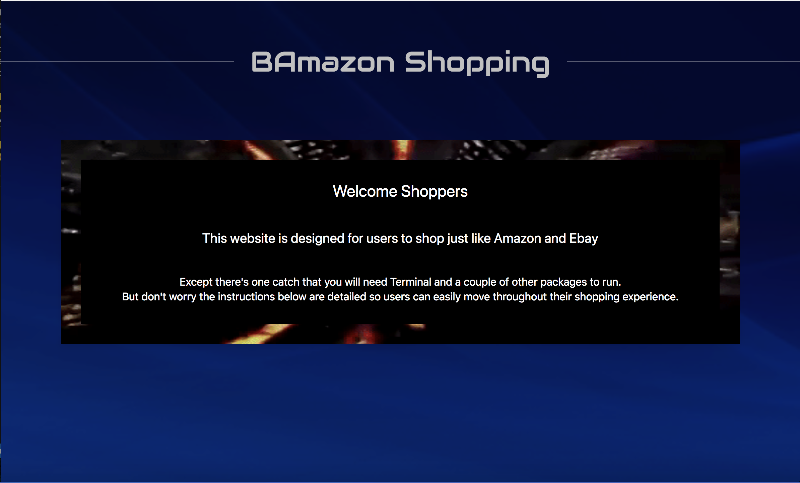
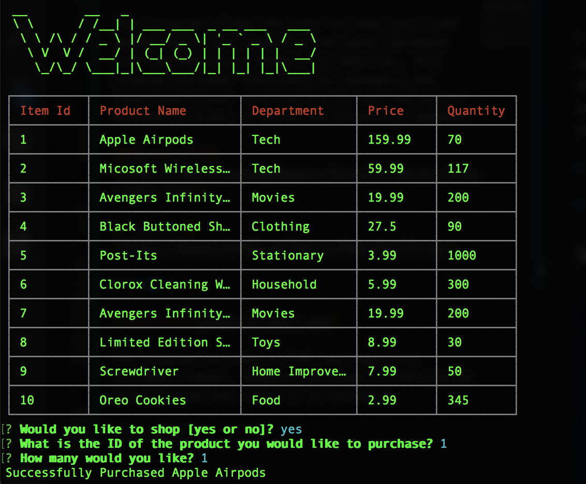

# BAamazon-Shop

This program allows the user to shop just like amazon while also updating the mysql database with the materials bought. In addition, this program includes functions for managers and supervisors that user can try to see the entire business process of sales and inventory updates. 

[BAmazon-Shop](file:///Users/muhammadawais/Desktop/Express-Shop/index.html)

[Portfolio](https://mawais54013.github.io/New-Portfolio/)

# Images 



The program includes a HTML web page that includes videos, images, and steps to setting up this program and using it on terminal. 



The example above shows when the customer(user) selects an product and buys the amount. This also shows a welcome screen and will often ask the user if they would like to buy. 

# Technology Used 

- Javascript
- Node.js
- HTML
- CSS
- Terminal
- UIkit
- JSON
- NPM
- MYSQL

# Code Snippets 
1) The code below sets up the table for the customer by selecting from products in the database and showing it using the loop. The table also has set widths for each column. The same goes for the tables for manager and supervisor codes. 
```
connection.query("SELECT * FROM products", function (err, res) {
var table = new Table({
    // make a new table 
    head: ["Item Id", "Product Name", "Department", "Price", "Quantity"],
    colWidths: [10, 20, 15, 10, 10]
});
// push the information to tables
for (var i = 0; i < res.length; i++) {
    table.push(
        [res[i].Item_id, res[i].Product_name, res[i].Department_name, res[i].Price, res[i].Stock_Available],
    );
}
console.log(table.toString());
```

2) The following codes uses UPDATE to change the value of stock of a product. First it checks to see if the user input can support the available inventory and then runs the functions to subtract the amount from the inventory and updates the database. This only updates the item the user picked instead of anything else so that the data for the other products can be unchanged. 

```
 var diff = input.Stock_Available - answer.pick;
if(input.Stock_Available < answer.pick)
{
    // console.log("Sorry we are out of stock");
    console.log("Insufficient quantity!");
    setUp();
}
else 
{ 
    connection.query(
        // this updates products from database with the id of the product to the new quantity
        "UPDATE products SET ? WHERE ?",
        [
            {
                Stock_Available: diff
            },
            {
                Item_id: input.Item_id
            }
        ],
        // this does nothing
        function(err, res)
        {

        }
    )
```

# Author 
[Muhammad Awais](https://github.com/mawais54013/Bootstrap-Portfolio)
